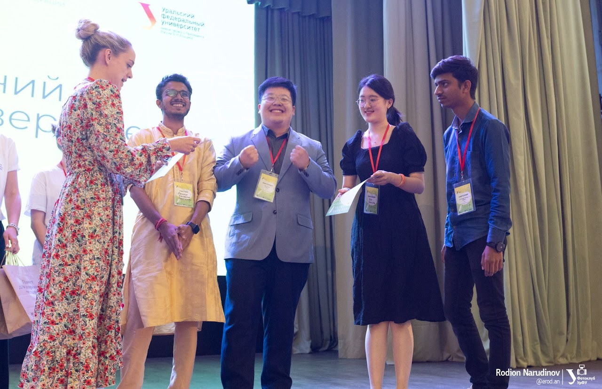

## Best Project Award

<table border="0">
 <tr>
    <td><b style="font-size:16px">Ural Federal University, Ekaterinburg, Russia</b>
        <ul> 
            <li> Team Leader </li>
            <li> Generative AI (text-to-image and image-to-3D) </li>
        </ul>
    </td>
    <td><b style="font-size:12px">Overall and International Category</b> </td>
 </tr>

 <tr>
    <td><b style="font-size:16px">MakeUC 2021 @ University of Cincinnati</b>
        <b>WINNER</b> of Three Awards in various categories
        <ul> 
            <li> Overall Winner </li>
            <li> + Wolfram Award </li>
            <li> + Best Social Hack </li>
        </ul>
    </td>
    <td><b style="font-size:12px">First Place Overall</b> </td>
 </tr>

 <tr>
    <td><b style="font-size:16px">Abdul Kalam Award</b>
        DD ROBOCON 2022 @ IIT Delhi
        <ul> 
            <li> Featured on National Television <b>DoorDarshan</b> Broadcast</li>
        </ul>
    </td>
    <td><b style="font-size:12px"><i>WINNER</i> of the Best Debut Team</b> </td>
 </tr>

 <tr>
    <td><b style="font-size:16px">Hackathon Winner</b>
        Hackbash'21 @ Google Developer Student Club
        <ul> 
            <li> Team Leader </li>
            <li> National Hackathon organized by an alliance of eight GDSCs across the country </li>
            <li> AI-based Accessibility and Social-Welfare Project </li>
        </ul>
    </td>
    <td><b style="font-size:12px"><i>WINNER</i> in the Domain of AI/ML/Web-Development</b> </td>
 </tr>

 <tr>
    <td><b style="font-size:16px">ROBOFEST 2.0</b>
        Gujarat Council on Science and Technology (GUJCOST) & DST, India
        <ul> 
            <li> IoT and AI-powered Prosthesis </li>
            <li> Project under Government of Gujarat, India </li>
            <li> Research funded by GUJCOST and DST </li>
            <li> Patent granted (funded by SSIP) </li>
        </ul>
    </td>
    <td><b style="font-size:12px"><i>WINNER</i> in the Domain of <i>Prosthetic Limb with Remote Sensors</i></b> </td>
 </tr>

 <tr>
    <td><b style="font-size:16px">Rajya Puraskar Recipient</b>
        Bharat Scouts and Guides Organisation
        <ul> 
            <li> Highest State-level Award for BS&G </li>
            <li> Active participation in Social Service </li>
        </ul>
    </td>
    <td><b style="font-size:12px">Received the <b>Governor's Award</b> from the then Governor of Gujarat State, late Om Prakash Kohli</b> </td>
 </tr>
</table>